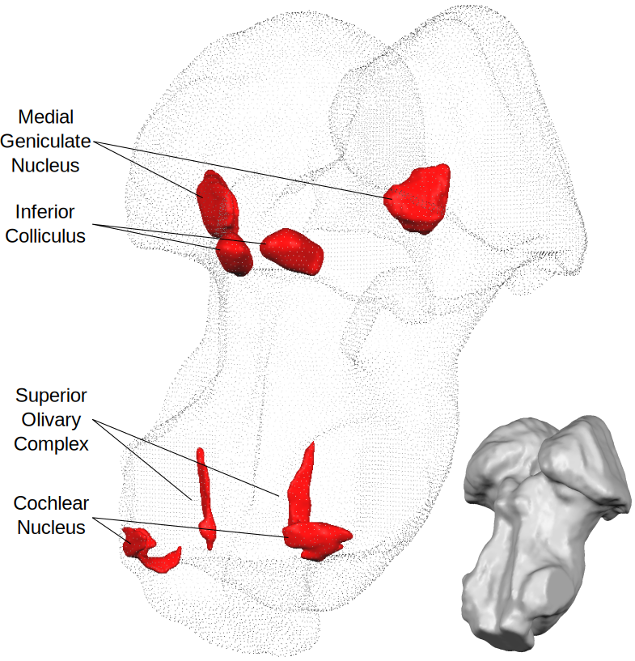

(work in progress...)

# Human subcortical auditory atlas
Resources from our subcortical (midbrain and brainstem) auditory pathway mapping project that combines state of the art post-mortem and in-vivo human magnetic resonance imaging (MRI) at ultra-high fields (7 Tesla) together with gold-standard human histology dataset for detailed validation. Our target regions were:

1. Medial geniculate body
2. Inferior colliculus
3. Superior olivary complex
4. Cochlear nucleus

In this endeavor, the major challenges were to understand the 3D shapes of these structures (in humans) from the diagrams and figures published in previous literature as well as communicating our results to our colleagues in a common reference system (MNI space). With this repository, we aim to supplement our manuscript by making the processes lead to our results more accessible to interested readers.

### Citation
TODO: add link to preprint

## Dependencies

### Data
We have used the datasets accessible from the following sources:

| Package                                                  | Used version |
|----------------------------------------------------------|--------------|
| [BigBrain](https://bigbrain.loris.ca/main.php)           | 2015 release |
| [MNI ICBM 152](http://www.bic.mni.mcgill.ca/ServicesAtlases/ICBM152NLin2009)| 2009b Nonlin. Sym.|
| [Post mortem (request)](http://www.civm.duhs.duke.edu/SharedData/DataSupplements.htm)| n/a        |
| [In vivo](TODO: add link)                                | ?        |

Post mortem anatomical images can be explored using [neuroglancer](http://oms.mit.edu:8080/#!%7B%22layers%22:%7B%22precomputed%22:%7B%22source%22:%22precomputed://http://oms.mit.edu:8080/precomputed%22%2C%22type%22:%22image%22%7D%7D%2C%22navigation%22:%7B%22pose%22:%7B%22position%22:%7B%22voxelSize%22:%5B50000%2C50000%2C50000%5D%2C%22voxelCoordinates%22:%5B789.3259887695312%2C577.9903564453125%2C586.8760986328125%5D%7D%7D%2C%22zoomFactor%22:25513.613430689424%7D%2C%22showSlices%22:false%2C%22layout%22:%224panel%22%7D).

Data produced by these analyses are available at [OSF](https://osf.io/hxekn/?view_only=be9ec398304344e8bb694a0658d77ed6).

### Software
These are the software packages we have used to process our data. Not all packages are used in all processes. You can see specifically required packages for each processing step in flowcharts or script docstrings.

| Package                                                  | Used version |
|----------------------------------------------------------|--------------|
| [ITK-SNAP](http://www.itksnap.org/)                      | 3.6.0        |
| [FSL](https://fsl.fmrib.ox.ac.uk/fsl)                    | 5.0.9        |
| [ANTs](http://stnava.github.io/ANTs/)                    | 2.1.0        |
| [DiPy](http://nipy.org/dipy/)                            | 0.14         |
| [NiPype](https://nipype.readthedocs.io)                  | 1.1.8        |
| [NiBabel](http://nipy.org/nibabel/)                      | 2.2.0        |
| [Brainvoyager](https://www.brainvoyager.com/)            | 2.8.4        |
| [Neuroelf](http://neuroelf.net/)                         | 1.1rc2       |
| [Matlab](https://www.mathworks.com/products/matlab.html) | 2016a        |
| [TrackVis](http://www.trackvis.org/)                     | 0.6.1        |
| [Geogram](http://alice.loria.fr/software/geogram)        | 1.6.7        |

_Note:_ This project is the culmination of ~4 years of work of two PhD students who started similar projects separately (one at Harvard and other in Maastricht University) but collaborated for the final product after ~3 years. As a result of this, so many different software packages are used in combination. We strongly believe in the spirit of open science therefore we put our best effort to make our work transparent with this repository. However, we are also aware that we have used a few commercial packages that might not be available for everyone. By sharing our flowcharts and code, we hope that future investigators might have a headstart to do better than us by using more modern methods.

## Support

Please use our GitHub issues page for posting questions or problems.

## License
The project is licensed under [BSD-3-Clause](https://opensource.org/licenses/BSD-3-Clause).
